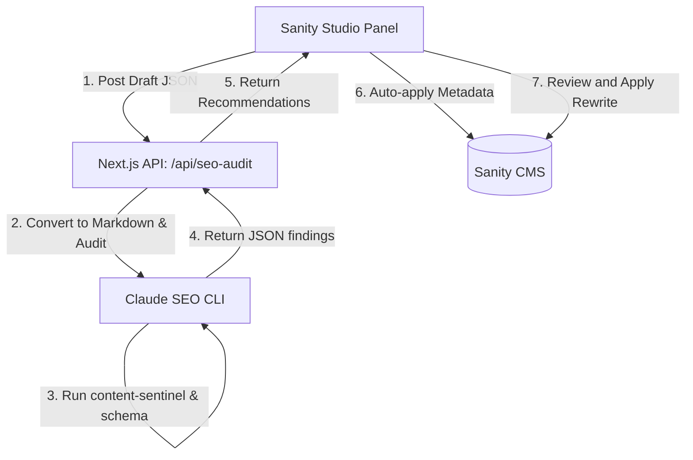

# Shorter Loop SEO & Brand Voice Co-Pilot Integration Plan

This plan details how to build a "One-Click SEO & Brand Voice Co-Pilot" inside **Shorter Loop Studio** (`sanity-cms`) by calling the **`claude-seo`** CLI and the `content-sentinel` brand voice subagent.

## Integration Architecture

We will implement a hybrid human-in-the-loop bridge between the CMS and the SEO auditor:



1. **Background Automation**: Structural items (meta title, description, schema markup) will be generated and auto-applied with a single click.
2. **Human-in-the-Loop Reviews**: Brand voice copy rewrites will be displayed as a side-by-side diff with an option to preview, tweak, and selectively implement.

---

## User Review Required

> [!IMPORTANT]
> The Next.js API route will execute the `claude-seo` runtime locally via child process execution. This requires the `claude-seo` main CLI launcher (`~/.claude/skills/seo/bin/claude-seo`) and dependencies to be installed on the hosting server or development machine.

---

## Proposed Changes

### 1. Website Next.js Backend (`sanity-cms/web/`)

#### [NEW] [route.ts](file:///d:/dev/shorterloop/sanity-cms/web/app/api/seo-audit/route.ts)
We will create a new endpoint `/api/seo-audit` that:
- Receives the raw Portable Text, title, and page details.
- Convers the Portable Text blocks to plain markdown text.
- Writes the text to a temporary file.
- Executes `claude-seo` local python script via `child_process.execFile`:
  ```bash
  ~/.claude/skills/seo/bin/claude-seo run --extension content-sentinel audit_content.py <temp_file> --json --web
  ```
- Additionally calls standard metadata and schema helpers (or runs `/seo schema`) to output suggested titles, descriptions, and JSON-LD markup.
- Returns a unified payload containing readability scores, spelling flags, schema markup, and voice rewrites.

---

### 2. Sanity Studio (`sanity-cms/studio/`)

#### [NEW] [SeoVoiceAuditor.tsx](file:///d:/dev/shorterloop/sanity-cms/studio/components/SeoVoiceAuditor.tsx)
We will create a custom Studio component that:
- Listens to the current active document draft.
- Renders an interactive sidebar card system:
  - **SEO Metrics Card**: Shows word count, sentence count, readability ease, and spelling flags.
  - **Meta Tags & Schema Card**: Shows current vs. optimized meta title/description and JSON-LD schema. Renders an **[Auto-Apply Metadata]** button to immediately patch the document fields.
  - **Brand Voice Card**: Shows the overall voice match score (1–5) and displays a side-by-side **Diff View** for any blocks (paragraphs/headings) scored $\le 2$, with an **[Apply Suggestion]** button.

#### [MODIFY] [sanity.config.ts](file:///d:/dev/shorterloop/sanity-cms/studio/sanity.config.ts)
Configure the `deskTool` (structure plugin) to register a split-pane view for eligible document types (such as `blogPost` and marketing pages). This split pane will render:
1. The standard form editor on the left.
2. The custom `SeoVoiceAuditor` panel on the right.

---

## Verification Plan

### Automated Tests
- Run `pytest` on `claude-seo` to verify no regressions in local audit logic.
- Run `npm run lint` and `npm run build` on `sanity-cms/web` and `sanity-cms/studio` to verify compilation and typescript type-safety.

### Manual Verification
- Run Next.js (`npm run dev` in `web/` on port 3000) and Sanity Studio (`npm run dev` in `studio/` on port 3333).
- Open a draft Blog Post in Sanity Studio, open the "SEO & Brand Voice" tab, verify it fetches recommendations, auto-applies meta tags, and displays human-in-the-loop diff buttons.
